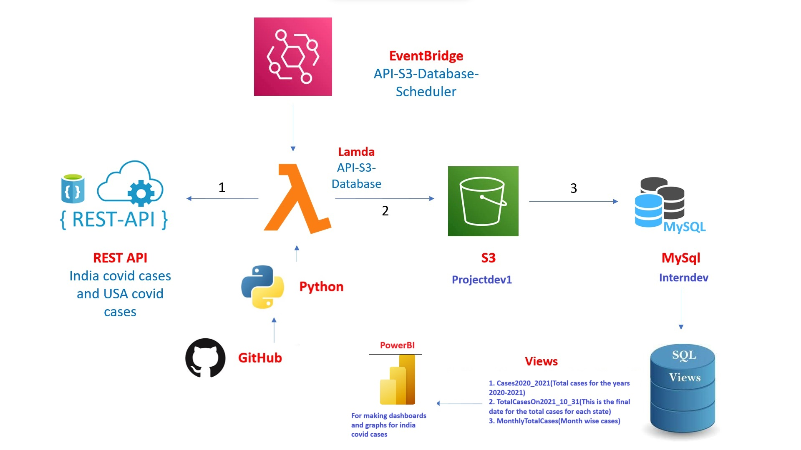

# **Project based in data analysis using Python and AWS platform**

## **Project Description :**
### *Storing in AWS S3 Bucket*
The REST API's were given for the following aspects are: india covid cases REST API and USA covid REST API. Firstly, we need to convert the ".json" format(REST API's) into ".CSV" format using Python and that csv data for both india and usa covid cases should be stored in AWS S3.

For USA Covid REST API, there should be provided a ceratin date in url and the data will be shown according to the date the user has given. The date should be provided in the events/event.json file in the '**changedate**' section.(YYYYMMDD)

### *Using Mysql to show the data in a database*
After stroing the data in S3 bucket(AWS), we have to create two schemas i.e '**staging_schema**' and '**BIDatamart**' using SQL scripts. In those schemas, we need to create tables tables of india and usa covid cases for each respectively.

In case of '**staging_schema**' the tables created are '**stg_india_covid**' and '**stg_US_covid**'.
In case of '**BIDatamart**' the tables created are '**india_covid**' and '**US_covid**'. After that, we need to create storing procedures for both india and US covid cases as '**sp_india_covid**' and '**sp_US_covid**'.

lastly, Views are been created as '**vw_statewise_cases**' for india covid cases which displays the total confirmed,recovered and deceased.

## **AWS EventBridge**
In the AWS platform, there is schedule created for the exisitng lamda function which runs for every 12 hours.

## **FlowChart**

## **Technical Stack:**
1. REST API
2. AWS CLI
3. AWS SAM CLI
4. Docker
5. WSL2
6. VS code
7. Python 3.9
8. AWS Lambda
9. AWS Lambda Layers
10. AWS S3
11. AWS RDS
12. Mysql
13. SQL
14. AWS IAM
15. AWS Cloudformation
16. AWS Eventbridge Scheduler

